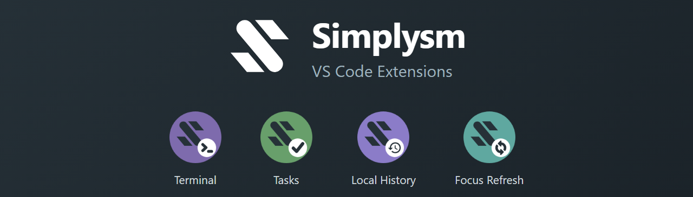

# simplysm-vscode

[English](README.md) | [한국어](README.ko.md)

[Simplysm](https://github.com/simplysm)의 작고 목적이 분명한 VS Code 확장 모노레포입니다.

## 확장 목록

| 확장 | 설명 |
| --- | --- |
| [Simplysm Terminal](https://marketplace.visualstudio.com/items?itemName=simplysm.simplysm-terminal) | 4분할 가능한 패널 터미널 — 세션을 그리드로 배치하고 탭을 원하는 곳으로 드래그 |
| [Simplysm Tasks](https://marketplace.visualstudio.com/items?itemName=simplysm.simplysm-tasks) | `.tasks` 메모 파일용 빠른 목록 편집기 — 할 일을 적고, 끝나면 지우기 |
| [Simplysm Local History](https://marketplace.visualstudio.com/items?itemName=simplysm.simplysm-local-history) | 파일 로컬 히스토리를 기록하고 파일·폴더를 과거 상태로 복원 — WebStorm의 Local History처럼 |
| [Simplysm Focus Refresh](https://marketplace.visualstudio.com/items?itemName=simplysm.simplysm-focus-refresh) | 창이 포커스를 되찾을 때 외부에서 변경된 파일을 다시 로드 — WebStorm의 frame activation sync처럼 |

각 확장의 자세한 내용은 [`packages/`](packages) 아래 README를 참고하세요.

## 개발

```sh
pnpm install
pnpm build      # 전체 패키지 빌드
pnpm typecheck
pnpm lint
pnpm test
```

VS Code에서 `F5`를 누르면 모든 확장이 로드된 Extension Development Host가 실행됩니다.

## 피드백

버그 제보와 기능 제안을 환영합니다 — [이슈 트래커](https://github.com/simplysm/simplysm-vscode/issues)를 이용해 주세요. 한국어로 작성하셔도 됩니다.

## 라이선스

[Apache-2.0](LICENSE)
