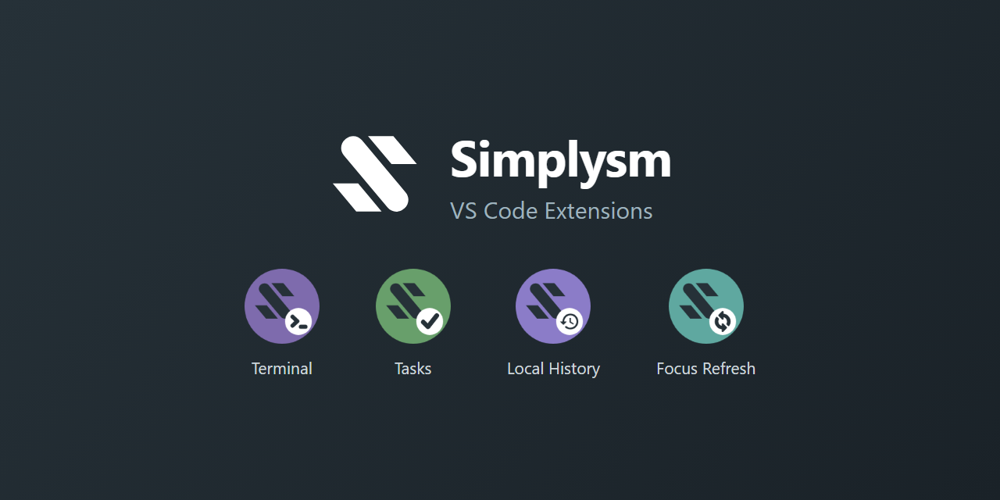

# simplysm-vscode

[English](README.md) | [한국어](README.ko.md)

A monorepo of small, focused VS Code extensions by [Simplysm](https://github.com/simplysm).

## Extensions

| Extension | Description |
| --- | --- |
| [Simplysm Terminal](https://marketplace.visualstudio.com/items?itemName=simplysm.simplysm-terminal) | A panel terminal you can split four ways — arrange sessions in a grid and drag tabs where you want them |
| [Simplysm Tasks](https://marketplace.visualstudio.com/items?itemName=simplysm.simplysm-tasks) | A quick list editor for `.tasks` memo files — jot tasks down, delete them when done |
| [Simplysm Local History](https://marketplace.visualstudio.com/items?itemName=simplysm.simplysm-local-history) | Records local file history and restores files or folders to a past state — like WebStorm's Local History |
| [Simplysm Focus Refresh](https://marketplace.visualstudio.com/items?itemName=simplysm.simplysm-focus-refresh) | Reloads externally changed files when the window regains focus — like WebStorm's frame activation sync |

See each extension's README under [`packages/`](packages) for details.

## Development

```sh
pnpm install
pnpm build      # build all packages
pnpm typecheck
pnpm lint
pnpm test
```

Press `F5` in VS Code to launch an Extension Development Host with all extensions loaded.

## Feedback

Bug reports and feature requests are welcome — please use the [issue tracker](https://github.com/simplysm/simplysm-vscode/issues). 한국어 이슈도 환영합니다.

## License

[Apache-2.0](LICENSE)
