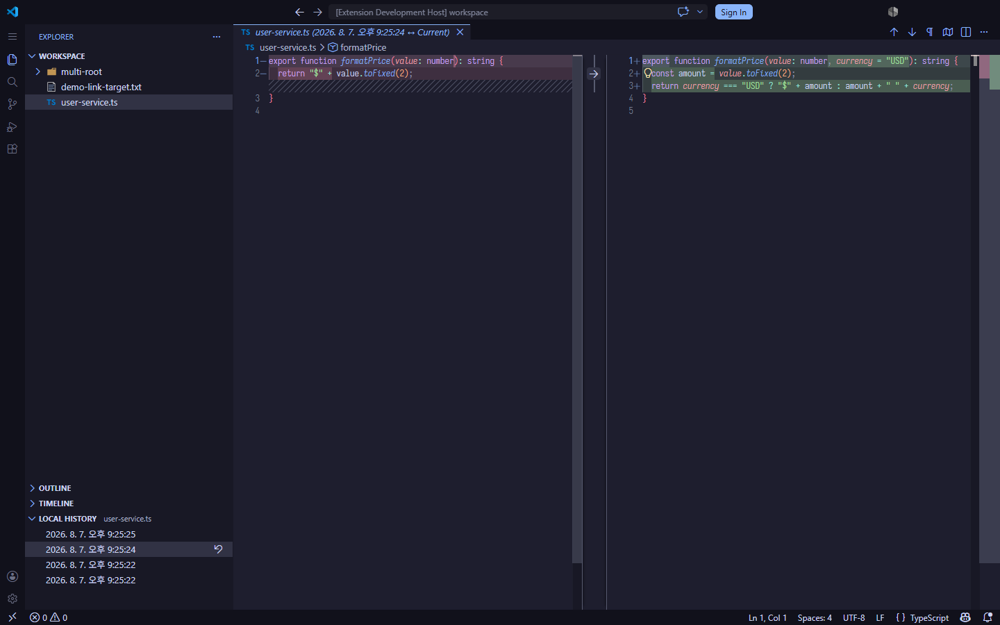

# Simplysm Local History

> 🇰🇷 한국어 설명은 [아래](#한국어-korean)에 있습니다.

Records local file history and restores files or folders to a past state — like WebStorm's Local History.

Git only protects what you commit. This extension snapshots your workspace files as you change them, so a bad refactor, an accidental delete, or a botched move + undo can be reverted even if you never committed. Unlike the built-in Timeline, it can restore an **entire folder** to a past state.

## Features

- **Automatic recording** — file changes are snapshotted in the background (file watcher + safety scans on startup/refocus); bursts like `git checkout` or `npm install` are grouped into one changeset.
- **Show History anywhere** — right-click a file *or folder* in the Explorer → **Show History**. Snapshots appear in a tree view; selecting one opens the built-in diff editor (multi-file diff for folders).
- **Rollback with a safety net** — restore the whole file/folder to the selected state, or roll back a single file. The current state is snapshotted right before rolling back, so a rollback itself can be undone.
- **Keeps your repo clean** — history is stored outside the workspace (deduplicated, compressed); nothing is added to your Git repository. Snapshots are kept for one year.
- Renames keep their history connected. English/Korean UI.

Note: changes made while VS Code is closed are not recorded — the startup scan only captures that files have changed since.

---

한국어 (Korean)

로컬 파일 이력을 기록하고 파일이나 폴더를 과거 상태로 복원합니다 — WebStorm의 Local History와 같은 역할입니다.

Git은 커밋한 것만 지켜줍니다. 이 확장은 워크스페이스 파일이 바뀔 때마다 스냅샷을 남기므로, 잘못된 리팩토링, 실수로 한 삭제, 꼬여버린 이동+undo도 커밋한 적이 없어도 되돌릴 수 있습니다. 내장 Timeline과 달리 **폴더 전체**를 과거 상태로 복원할 수 있습니다.

### 기능

- **자동 기록** — 파일 변경이 백그라운드에서 스냅샷됩니다 (파일 워처 + 기동/재포커스 시 안전망 스캔). `git checkout`이나 `npm install` 같은 대량 변경은 하나의 체인지셋으로 묶입니다.
- **어디서든 Show History** — Explorer에서 파일 *또는 폴더*를 우클릭 → **Show History**. 스냅샷이 트리 뷰에 표시되고, 선택하면 내장 diff 에디터가 열립니다 (폴더는 다중 파일 diff).
- **안전망 있는 롤백** — 파일/폴더 전체를 선택한 시점으로 복원하거나, 파일 하나만 롤백할 수 있습니다. 롤백 직전 현재 상태가 자동 스냅샷되므로 롤백 자체도 되돌릴 수 있습니다.
- **저장소를 깨끗하게** — 이력은 워크스페이스 밖에 저장되며 (중복 제거·압축), Git 저장소에는 아무것도 추가되지 않습니다. 스냅샷은 1년간 보관됩니다.
- 이름 변경 시에도 이력이 이어집니다. 영어/한국어 UI 지원.

참고: VS Code가 꺼져 있는 동안의 변경은 기록되지 않습니다 — 기동 시 스캔은 "파일이 바뀌었다는 사실"만 잡습니다.

