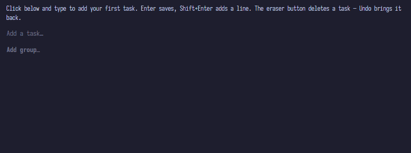
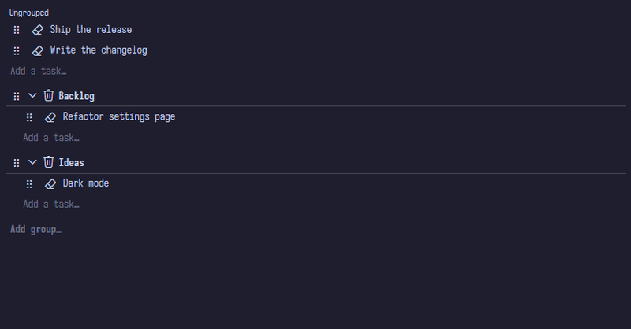

# Simplysm Tasks

> 🇰🇷 한국어 설명은 [아래](#한국어-korean)에 있습니다.

A quick list editor for `.tasks` memo files — jot tasks down, delete them when done.

Opening a `.tasks` file shows a dedicated list UI instead of the plain text editor. Every row is always editable — click the task text and type (the handle and the eraser on the left are for reordering and completing, not editing). Done means deleted: erase a task and it is removed (undo brings it back), so there is no checkbox state to manage.



## Features

- **Always-editable rows** — no view/edit mode; click a task and edit in place. Changes are saved the moment you confirm (Enter or leaving the row); no dirty state, no Ctrl+S.
- **Fast entry** — `Enter` saves and starts the next task; `Shift+Enter` (also `Ctrl+Enter` / `Alt+Enter`) adds a line break inside a task; `Esc` reverts the row.
- **Erase to complete** — the eraser in front of each task marks it done, which deletes it. `Ctrl+Z` restores.
- **Groups** — add group headers, rename them in place, drag a whole group (header + tasks), collapse/expand (the collapsed state is saved in the file), and delete a group together with its tasks.
- **Reorder** — drag the handle, or press `Ctrl+Alt+↑/↓` to move a task (or a group, from its name field) one step. Moving across a header changes the task's group. Groups stay below the ungrouped section, so a group cannot move above it.
- **Undo / redo** — `Ctrl+Z` / `Ctrl+Y` / `Ctrl+Shift+Z`, per confirmed operation, also saved immediately. Inside an edit field these apply to your typing first; when the field is unedited they fall through to document history.


- **External change sync** — edits made outside the editor are picked up immediately, without losing text you are typing.
- **Safe file handling** — unknown JSONL fields are preserved; if a line cannot be parsed, editing is blocked and the error cause is shown with an "Open as Text" shortcut.

Use the **Tasks: New Tasks File** command (also in File > New File…) to create your first `.tasks` file.

## File format

A `.tasks` file is JSONL — one task or group header per line. Tasks after a header belong to that group; tasks before the first header are ungrouped.

```jsonl
{"text":"Ship the release"}
{"group":"In progress"}
{"text":"Write the changelog"}
{"group":"Backlog","collapsed":true}
{"text":"Multi-line\nnotes are fine"}
```

- `{"text":"…"}` — a task. Line breaks are stored as `\n` inside the JSON string.
- `{"group":"…"}` — a group header. Optional `"collapsed":true` keeps the group folded.
- Unknown fields on any line are preserved untouched.

---

<details>
<summary id="한국어-korean">한국어 (Korean)</summary>

`.tasks` 메모 파일을 위한 빠른 리스트 편집기 — 할 일을 적고, 끝나면 지우세요.

`.tasks` 파일을 열면 일반 텍스트 편집기 대신 전용 리스트 UI가 표시됩니다. 모든 행은 항상 편집 가능합니다 — 할 일 텍스트를 클릭하고 바로 입력하세요 (왼쪽의 핸들과 지우개는 순서 변경·완료 처리용이지 편집용이 아닙니다). 완료 = 삭제입니다: 할 일을 지우면 제거되며 (실행 취소로 복원 가능), 관리할 체크박스 상태가 없습니다.

### 기능

- **항상 편집 가능한 행** — 보기/편집 모드 구분 없이 할 일을 클릭해 바로 수정합니다. 확정(Enter 또는 행 이탈)하는 순간 저장되며, dirty 상태도 Ctrl+S도 없습니다.
- **빠른 입력** — `Enter`는 저장 후 다음 할 일 입력 시작; `Shift+Enter`(또는 `Ctrl+Enter` / `Alt+Enter`)는 할 일 안에서 줄바꿈; `Esc`는 행을 원래대로 되돌립니다.
- **지워서 완료** — 각 할 일 앞의 지우개로 완료 처리하면 그 할 일이 삭제됩니다. `Ctrl+Z`로 복원할 수 있습니다.
- **그룹** — 그룹 헤더 추가, 이름 즉시 변경, 그룹 전체(헤더 + 할 일) 드래그, 접기/펼치기(접힘 상태는 파일에 저장), 그룹과 그 안의 할 일 함께 삭제가 가능합니다.
- **순서 변경** — 핸들을 드래그하거나 `Ctrl+Alt+↑/↓`로 할 일(그룹은 이름 필드에서)을 한 칸씩 이동합니다. 헤더를 넘어 이동하면 할 일의 그룹이 바뀝니다. 그룹은 항상 그룹 없는 영역 아래에 있으며, 그 위로 이동할 수 없습니다.
- **실행 취소 / 다시 실행** — `Ctrl+Z` / `Ctrl+Y` / `Ctrl+Shift+Z`, 확정된 작업 단위로 동작하며 즉시 저장됩니다. 편집 필드 안에서는 입력 중인 텍스트에 먼저 적용되고, 필드가 수정되지 않은 상태면 문서 이력으로 넘어갑니다.
- **외부 변경 동기화** — 편집기 밖에서 수정된 내용은 즉시 반영되며, 입력 중인 텍스트는 유지됩니다.
- **안전한 파일 처리** — 알 수 없는 JSONL 필드는 그대로 보존됩니다. 파싱할 수 없는 줄이 있으면 편집이 차단되고 오류 원인과 함께 "Open as Text" 바로가기가 표시됩니다.

첫 `.tasks` 파일은 **Tasks: New Tasks File** 명령(File > New File… 에도 있음)으로 만드세요.

### 파일 형식

`.tasks` 파일은 JSONL 형식으로, 한 줄에 할 일 또는 그룹 헤더 하나입니다. 헤더 뒤의 할 일은 그 그룹에 속하고, 첫 헤더 앞의 할 일은 그룹이 없습니다.

```jsonl
{"text":"Ship the release"}
{"group":"In progress"}
{"text":"Write the changelog"}
{"group":"Backlog","collapsed":true}
{"text":"Multi-line\nnotes are fine"}
```

- `{"text":"…"}` — 할 일. 줄바꿈은 JSON 문자열 안에 `\n`으로 저장됩니다.
- `{"group":"…"}` — 그룹 헤더. `"collapsed":true`를 넣으면 접힌 상태가 유지됩니다.
- 어떤 줄이든 알 수 없는 필드는 그대로 보존됩니다.

</details>
