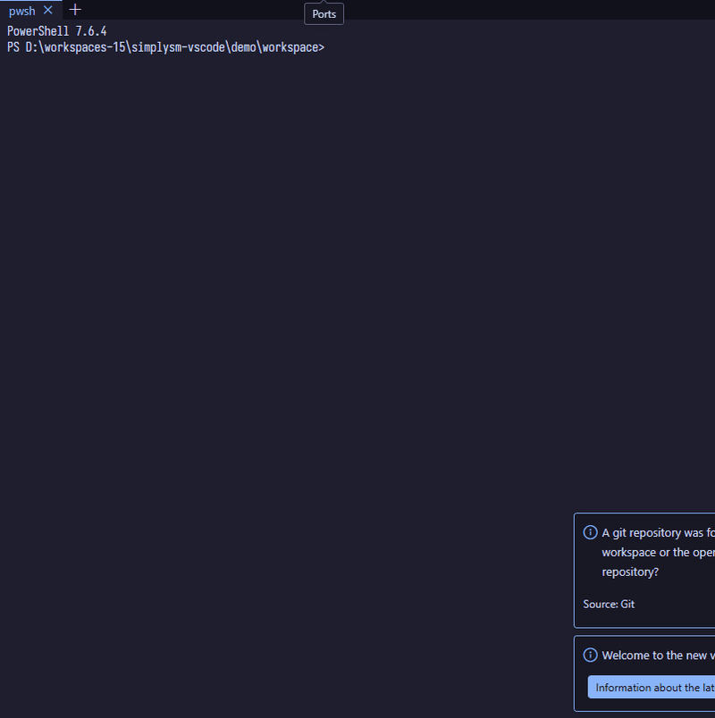

# Simplysm Terminal

> 🇰🇷 한국어 설명은 [아래](#한국어-korean)에 있습니다.

A panel terminal you can split into a real 2D grid — arrange sessions by dragging tabs, and keep them alive across window reloads.

The built-in terminal only splits side-by-side within a group. This one treats the panel as a grid: drag a tab to any edge to split vertically or horizontally, drop it on a pane to merge, and drag borders to resize. Shell processes are owned by a detached daemon, so `Developer: Reload Window` (after an extension or settings change) no longer kills your builds and dev servers.

## Features

- **Grid layout by drag & drop** — drag a tab to a pane edge to split up/down or left/right, drop on the center to merge; drop targets are previewed while dragging, `Esc` cancels. Borders resize adjacent panes; ratios survive panel resizes.
- **Sessions survive reload** — tabs, names, layout, screen contents, and the *same shell processes* are restored after a window reload. Closing the window for real ends the shells (no ghost processes). If the daemon dies or the extension was updated, sessions are shown as exited with their last screen — nothing pretends to be alive.
- **Shell-first keys** — keys go to the shell by default (`Ctrl+R` history search works); VS Code keeps only what's in `terminal.integrated.commandsToSkipShell`. `Ctrl+F` opens in-terminal search.
- **Session names** — rename a tab in place; the name sticks even before/after the session starts, empty name falls back to the shell name.
- **Start directory** — in a multi-root workspace, each new tab asks which folder to start in.
- **Practical output handling** — `Ctrl+click` file paths to open them in the editor, right-click to copy/paste (copy when text is selected, paste otherwise), `Ctrl+C`/`Ctrl+V` clipboard behavior, OSC 52 support.
- **Native look & feel** — follows your VS Code color theme and terminal font settings live, WebGL rendering, IME-safe (CJK input).
- Requires a trusted workspace (it starts shells in your folders). English/Korean UI.

---

한국어 (Korean)

패널 터미널을 실제 2D 그리드로 분할할 수 있습니다 — 탭을 드래그해 세션을 배치하고, 창을 다시 로드해도 세션이 유지됩니다.

내장 터미널은 그룹 안에서 좌우 분할만 됩니다. 이 터미널은 패널을 그리드로 다룹니다: 탭을 아무 가장자리로 드래그하면 상하/좌우로 분할되고, 창 위에 드롭하면 병합되며, 경계를 드래그해 크기를 조절합니다. 셸 프로세스는 분리된 데몬이 소유하므로, (확장이나 설정 변경 후의) `Developer: Reload Window`가 더 이상 빌드나 개발 서버를 죽이지 않습니다.

### 기능

- **드래그 & 드롭 그리드 배치** — 탭을 창 가장자리로 드래그하면 상하/좌우로 분할되고, 중앙에 드롭하면 병합됩니다. 드래그 중에는 드롭 위치가 미리 표시되며 `Esc`로 취소합니다. 경계를 드래그하면 인접한 창의 크기가 조절되고, 비율은 패널 크기 변경 후에도 유지됩니다.
- **다시 로드해도 세션 유지** — 창을 다시 로드하면 탭, 이름, 배치, 화면 내용, 그리고 *동일한 셸 프로세스*가 복원됩니다. 창을 실제로 닫으면 셸도 종료됩니다 (유령 프로세스 없음). 데몬이 죽었거나 확장이 업데이트된 경우에는 세션이 마지막 화면과 함께 종료 상태로 표시됩니다 — 살아있는 척하지 않습니다.
- **셸 우선 키 입력** — 키는 기본적으로 셸로 전달됩니다 (`Ctrl+R` 히스토리 검색 동작). VS Code는 `terminal.integrated.commandsToSkipShell`에 있는 것만 가져갑니다. `Ctrl+F`는 터미널 내 검색을 엽니다.
- **세션 이름** — 탭 이름을 그 자리에서 변경할 수 있습니다. 이름은 세션 시작 전후에도 유지되며, 비워두면 셸 이름으로 표시됩니다.
- **시작 디렉터리** — 멀티 루트 워크스페이스에서는 새 탭마다 어느 폴더에서 시작할지 묻습니다.
- **실용적인 출력 처리** — 파일 경로를 `Ctrl+클릭`하면 편집기에서 열리고, 우클릭으로 복사/붙여넣기(텍스트 선택 시 복사, 아니면 붙여넣기), `Ctrl+C`/`Ctrl+V` 클립보드 동작, OSC 52 지원.
- **네이티브 룩 & 필** — VS Code 색 테마와 터미널 글꼴 설정을 실시간으로 따르며, WebGL 렌더링, IME 안전(한중일 입력) 지원.
- 신뢰할 수 있는 워크스페이스가 필요합니다 (폴더에서 셸을 시작하기 때문). 영어/한국어 UI 지원.

